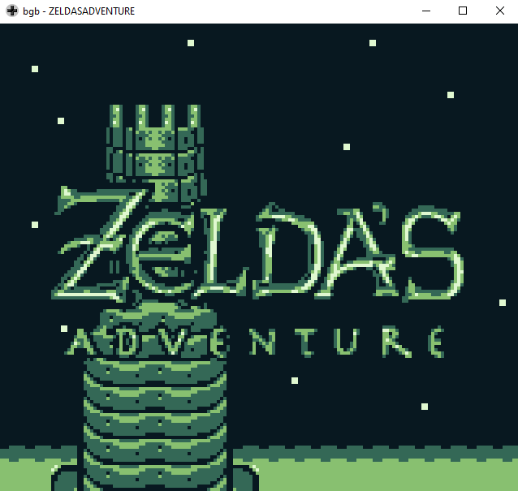

# Zelda's Adventure

A port of Zelda's Adventure for the Philips CD-i to the Gameboy.

The culmination of DMG Adventure [part I](https://github.com/john-lay/dmg-adventure), [part II](https://github.com/john-lay/dmg-adventure-ii), [part III](https://github.com/john-lay/dmg-adventure-iii) and [za engine](https://github.com/john-lay/za-engine)

Created with a [fork](https://github.com/john-lay/gb-studio) of [GB Studio](https://www.gbstudio.dev/)

## Installation

If you want to play the game, the ROM can be downloaded from [here](https://github.com/john-lay/zeldas-adventure/releases)

If you want to build or edit the game you will need to build the modified copy of GB Studio (The game was built with a fork of version `3.0.3`), which can be downloaded from [here](https://github.com/john-lay/gb-studio/releases).
The scenes are build using [Tiled](https://www.mapeditor.org/) and can be found in `/assets/tilemaps` and tilesets are taken from [Link's awakening disassembly project](https://github.com/zladx/LADX-Disassembly/tree/master/src/gfx).
