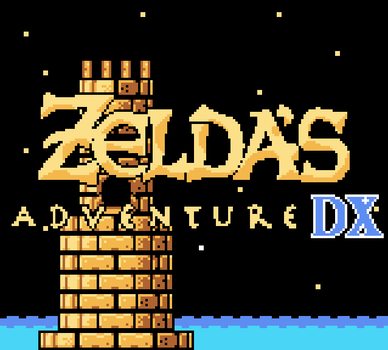

# Zelda's Adventure

A port of Zelda's Adventure for the Philips CD-i to the Gameboy Color.

Created with [GB Studio](https://www.gbstudio.dev/)

## Installation

If you want to play the game, the ROM can be downloaded from [here](https://github.com/john-lay/zeldas-adventure/releases)

If you want to build or edit the game you will need version 4.x of GB Studio.
The scenes are build using [Tiled](https://www.mapeditor.org/) and can be found in `/assets/tilemaps` and tilesets are taken from [Link's awakening disassembly project](https://github.com/zladx/LADX-Disassembly/tree/master/src/gfx).

## Documentation
A detailed list of items, enemies and GB Studio technical notes can be found in the [documentation](/documentation/) folder of the project.
- [bestiary](/documentation/bestiary.md)
- [cast](/documentation/cast.md)
- [inventory](/documentation/inventory.md)
- [technical notes](/documentation/technical%20notes.md)

## Credits
There are a lot of people and places that helped me put this project together. In no particular order:

- [Gaming Monsters youtube channel](https://www.youtube.com/channel/UCMMhSfBStEti-Lqzs30HYWw) Taught me a lot about GBDK
- [MundyC's Guide and Walkthrough](https://gamefaqs.gamespot.com/cdi/564215-zeldas-adventure/faqs/78656/) Invaluable source of information and names
- [Grumpmeister's Speedrum](https://www.youtube.com/watch?v=5lYiXTbfwSg) Zelda's Adventure speedrun
- [Douggernaught's Speedrum](https://www.youtube.com/watch?v=fLC6pa3T7m4) Zelda's Adventure speedrun

Sprite references
- [zladx/LADX-Disassembly](https://github.com/zladx/LADX-Disassembly) Links Awakening DX Disassembly
- [Spriters Resource](https://www.spriters-resource.com/game_boy_gbc/thelegendofzeldalinksawakeningdx/) Link's Awakening sprite reference
- [Spriters Resource](https://www.spriters-resource.com/game_boy_gbc/thelegendofzeldaoracleofages/) Oracle of Ages sprite reference
- [Zelda Galaxy](https://www.zeldagalaxy.com/sprites-gbc-ooa/) Oracle of Ages sprite reference
- [Spriters Resource](https://www.spriters-resource.com/game_boy_gbc/thelegendofzeldaoracleofseasons/) Oracle of Seasons sprite reference
- [Zelda Galaxy](https://www.zeldagalaxy.com/sprites-gbc-oos/) Oracle of Seasons sprite reference
- [Daniel Brother-Bear Barras](https://www.youtube.com/@TheRealMethuselah) His excellent Zelda 1 remake in the style of Link's Awakening DX / Oracle games

Zelda's Adventure wiki
- [Zelda Fandom Enemy reference](https://zelda.fandom.com/wiki/Enemies_in_Zelda%27s_Adventure)
- [Zelda Fandom Spell reference](https://zelda.fandom.com/wiki/Spells_of_Zelda%27s_Adventure)
- [Zelda Fandom Item reference](https://zelda.fandom.com/wiki/Items_in_Zelda%27s_Adventure)
- [Zelda Fandom Character reference](https://zelda.fandom.com/wiki/Characters_in_Zelda%27s_Adventure)
- [Zelda Fandom Map reference](https://zelda.fandom.com/wiki/Category:Zelda%27s_Adventure_Maps)

GB Studio Plugin
- [Shin's Adventure Reforged](https://github.com/shin-gamedev/gbs-plugins) (used)
- [Tomo's XV Sprite Tile Replacer](https://github.com/tomo666/gb-studio-xv-plugins) (inspired)

### Special thanks to the whole GB Studio team and Beatscribe for providing the music
