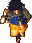
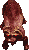
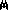
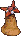
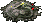
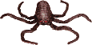
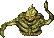
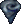
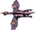
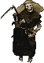

# Bestiary
A list of enemies from Zelda's Adventure mapped to their counterparts from the 3 possible Zelda game boy titles.

## Notes on duplicates
- There are 2 varieties of **Deeler** in the CDi version, both are represented by the Gameboy **Beetle**
- There are 2 varieties of **Crockorock** in the CDi version, both are represented by the Gameboy **Sand Crab**
- The **Dragonfly** and **Loccasin** are similar enemies in the CDi version, they are represented by the Gameboy **Battle Bat** (The boss in the Eagle tower's familiar)
- There are 3 varieties of **Zola**'s (Zoras) in the CDi version, all represented by the **Zora**
- There is a pink bird called the **Moby** and a grey **Romraven** in the CDi version, they are represented by the Gameboy **Crow**
- There is a purple and turquoise variety of the **Seagull** in the CDi version, the Gameboy **Dacto** represents them

## Enemies 
Regular enemies found in the overworld and dungeons.

| CDi         | Gameboy     |
| :---------: | :---------: |
|    Bago-Bago |    Piranha |
|    Blacksmith |    Subrosian Blacksmith |
|    Bolla |    Monkey |
|    Crockarock |    Sand Crab |
|    Crockarock |    Sand Crab |
|    Crystal Shard |    Crystal Shard |
|    Deeler |    Beetle |
|    Deeler (alt) |    Beetle |
|    Dragonfly |    Battle Bat |
|    Floor Spikes |    Floor Spikes |
|    Gibdo |    Gibdo |
|    Giant Squid |    Bloober |
|    Goriya |    Goriya |
|    Iron Knuckle |    Darknut |
|    Jack |    Anti-Fairy |
|    Jackaroo |    Iron Mask |
|    Kannis |    Moosh |
|    Keese |    Keese |
|    Lanmola |    Pincer |
|    Leever |    Leever |
|    Loccasin |    Battle Bat |
|    Lowder |    Hardhat Beetle |
|    Mimic Mole |    Mad Bomber |
|    Moblin |    Moblin |
|    Moby |    Crow |
|    Molluska |    Spiny Beetle |
|    Octorok |    Octorok |
|    Patra |    Eyesoar |
|    Peahat |    Peahat |
|    Pols Voice |    Pols Voice |
|    Romraven |    Crow |
|    Snake |    Rope |
|    Spiked Block |    Blade Trap |
|    Stalfos |    Stalfos |
|    Swamp Zola |    Zora |
|    River Zola |    Zora |
|    Cave Zola |    Zora |
|    Tektite |    Tektite |
|    Tektite (alt) |    Tektite |
|    Tornado |    Gale Seed Effect |
|    Turtle |    Turtle |
|    Zol |    Zol |
|    Alligaroo |    Tokay |
|    Baboon Head |     Magnesu |
|    Seagull Turquoise |    Dacto |
|    Seagull Purple |    Dacto |
|    Gnome |    Pig Warrior |
|    Wallmaster |    Wallmaster |
|    Wizzrobe |    Wizzrobe |
|    Vire |    Vire |
|    Volta |    Pairodd |
|    Zol |    Buzz Blob |
|    Stingray |    Water Tektite |

## Mini-Bosses
Special enemies and mid-dungeon bosses.

| CDi         | Gameboy     |
| :---------: | :---------: |
|   Sardak |    Shrouded Stalfos |
|   Vapora |    Smog |
|   Seamonster |    Aquamentus |
|   Kelpie |    Possessed Nayru |
|   Red/Blue/Green Knight |    Ambi Guard riding Dimitri |
|   Maxus |    Ambi Guard |

## Bosses
Dungeon masters guarding a celestial sign.

| CDi         | Gameboy     |
| :---------: | :---------: |
|   Llort |    Blue Stalfos |
|   Pasquinade |    Pumpkin Head |
|   Avianna |    Swoop |
|   Malmord |    Agunima |
|   Agwanda |    Green Camo Goblin |
|   Ursore |    Moosh |
|   Warbane |    Vire |
|   Gannon |    Ganon |

## Notes on enemy attack/defence

### Zelda with 3 hearts

| Enemy | Attack (damage to Zelda) | Defense (hits to kill) |
| :---: | :----------------------: | :--------------------: |
| Zol   | 1 (half heart) | 2 |
| Moblin | 1 (half heart) | 3 |
