# Cast
A list of characters from Zelda's Adventure and who plays them from the 3 possible Zelda game boy titles.

A list of the Zelda's Adventure characters can be found [here](https://zelda.fandom.com/wiki/Characters_in_Zelda%27s_Adventure).

## Plain of Andor

| CDi         | Gameboy     | Notes      |
| :---------: | :---------: | :--------- |
|   Beggar |    Mamasha | Looking for money for her Children |
|   Glebb |    Grandma Ulrira | n/a |
|   Krebb |    Cucco Keeper | (Mobilin's Head Inn) Gives dagger |
|   Lothar |    Trendy Game Shop Owner | (Mobilin's Head Inn) Inn Keeper |
|   Riddle Woman | 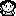   Madam Meow-Meow | (Mobilin's Head Inn) |
|   Tired Traveller |    Grandpa Ulrira | (Mobilin's Head Inn) |

## Forest of Ogbam

| CDi         | Gameboy     | Notes      |
| :---------: | :---------: | :--------- |
|   Forest Trader |    Town Shopkeeper | n/a |
| 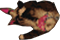  Hag |    Syrup | n/a |

## Meadow of Skotness

| CDi         | Gameboy     | Notes      |
| :---------: | :---------: | :--------- |
|   Farmer |    Tarin | n/a |
|   Ghost Farmer |    Ghost | n/a |
|   Talking Mushroom | 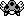   Bomber | n/a |

## Great Wimbich

| CDi         | Gameboy     | Notes      |
| :---------: | :---------: | :--------- |
| 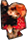  Blacksmith |    Subrosian Smithy | n/a |
| 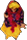  Alice |    OoA Past NPC Young Lady | n/a |
|   Eric and Ian | 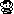    Quadruplets | n/a |
| 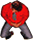  Twins Dad |    Papahl | n/a |
|   Lounger |    OoA Past NPC Young Guy | n/a |
| 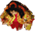  Madam-Kriggle |    OoA Present NPC Old Lady | n/a |
|   Shopkeeper |    OoA Mamamu-Yan | dog owner |
|   Knave |    [OoA Comedian | n/a |
|   Dog |    OoA Mamamu-Yan's Dog | n/a |
|   Town Merchant | 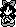   Crazy Tracy | n/a |
|   Yvonne |    Marin | musician |

## Forest of Torian

| CDi         | Gameboy     | Notes      |
| :---------: | :---------: | :--------- |
|   Sir Basil |    Ambi Guard | n/a |
|   White Steed Lodgekeeper |    Prince Richard | n/a |
|   White Steed Barman |    Mayor Ruul | n/a |
|   White Steed Patron 1 |    OoS Drunk | n/a |
|   White Steed Patron 2 |    OoA Present NPC Old Guy | n/a |
| 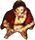  Waldensop |    OoA Mayor Plen | n/a |

## Ubato Hills

| CDi         | Gameboy     | Notes      |
| :---------: | :---------: | :--------- |
|   Bard 1 |    OoS Guitar Player | n/a |
|   Bard 2 |    OoA Past Young Guy Alt | n/a |
|   Ethera |    OoS Dog Owner | n/a |
|   Ethera's Dog |    OoS Flash | n/a |
| 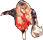  Gwynla | 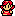   OoA Present Yound Lady | n/a |
|   Lonlyn |    OoS Old Guy | n/a |
