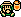

# Cast
A list of characters from Zelda's Adventure and who plays them from the 3 possible Zelda game boy titles.

A list of the Zelda's Adventure characters can be found [here](https://zelda.fandom.com/wiki/Characters_in_Zelda%27s_Adventure).

## Plain of Andor

| CDi         | Gameboy     | Notes      |
| :---------: | :---------: | :--------- |
|   Beggar |    Mamasha | Looking for money for her Children |
|   Glebb |    Grandma Ulrira | n/a |
|   Krebb |    Grandpa Ulrira | (Mobilin's Head Inn) Gives dagger |
|   Lothar |    Trendy Game Shop Owner | (Mobilin's Head Inn) Inn Keeper |
|   Riddle Woman |    Madam Meow-Meow | (Mobilin's Head Inn) |
|   Tired Traveller |    OoS Drunk | (Mobilin's Head Inn) |

## Forest of Ogbam

| CDi         | Gameboy     | Notes      |
| :---------: | :---------: | :--------- |
|   Forest Trader |    Town Shopkeeper | n/a |
|   Hag |    Syrup | n/a |

## Meadow of Skotness

| CDi         | Gameboy     | Notes      |
| :---------: | :---------: | :--------- |
|   Farmer |    Tarin | n/a |
|   Ghost Farmer |    Ghost | n/a |
|   Talking Mushroom |    Bomber | n/a |

## Great Wimbich

| CDi         | Gameboy     | Notes      |
| :---------: | :---------: | :--------- |
|   Blacksmith |    Subrosian Smithy | n/a |
|   Alice |    OoA Past NPC Young Lady | n/a |
|   Eric and Ian |     Quadruplets | n/a |
|   Twins Dad |    Papahl | n/a |
|   Lounger |    OoA Past NPC Young Guy | n/a |
|   Madam-Kriggle |    OoA Present NPC Old Lady | n/a |
|   Shopkeeper |    OoA Mamamu-Yan | dog owner |
|   Knave |    OoA Comedian | n/a |
|   Dog |    OoA Mamamu-Yan's Dog | n/a |
|   Town Merchant |    Crazy Tracy | n/a |
|   Yvonne |    Marin | musician |

## Forest of Torian

| CDi         | Gameboy     | Notes      |
| :---------: | :---------: | :--------- |
|   Sir Basil |    Ambi Guard | n/a |
|   White Steed Lodgekeeper |    Prince Richard | n/a |
|   White Steed Barman |    Mayor Ruul | n/a |
|   White Steed Patron 1 |    OoS Drunk Alt | n/a |
|   White Steed Patron 2 |    OoA Present NPC Old Guy | n/a |
|   Waldensop |    OoA Mayor Plen | n/a |

## Ubato Hills

| CDi         | Gameboy     | Notes      |
| :---------: | :---------: | :--------- |
|   Bard 1 |    OoS Guitar Player | n/a |
|   Bard 2 |    OoA Past Young Guy Alt | n/a |
|   Ethera |    OoS Dog Owner | Horon NPC, not Flash's owner |
|   Ethera's Dog |    OoS Flash | n/a |
|   Gwynla |    OoA Present Yound Lady | n/a |
|   Lonlyn |    OoS Old Guy | n/a |

## North Gubasha Desert

| CDi         | Gameboy     | Notes      |
| :---------: | :---------: | :--------- |
|   Bitterbeck |    LA Fisherman | House keeper |
|   Nimonee |    OoS Impa | North-East tip of world map |
|   Thabul |    OoS Old Lady | mystic outside cave |

## South Gubasha Desert

| CDi         | Gameboy     | Notes      |
| :---------: | :---------: | :--------- |
|   Myntoll |    OoA Carpenter | n/a |
|   Toatobar |    OoS Young Lady | n/a |
|   Gubasha Sleeping Guard |    OoS Sokra | n/a |

## Dry Canyon

| CDi         | Gameboy     | Notes      |
| :---------: | :---------: | :--------- |
|   Sleeping Guard |    OoS Sleeping Talon | n/a |
|   Shurmak |    OoA Queen Ambi | n/a |

## Seacoast Plain

| CDi         | Gameboy     | Notes      |
| :---------: | :---------: | :--------- |
|   Beach Merchant |    OoS Vasu | n/a |
|   Beach House Old Man |    LA Old Man | n/a |
|   Beach House Old Woman |    OoA Old Lady | n/a |
|   Seafarer |    OoA Postman | n/a |
|   Seafarer 2 |    OoA Old man | Wearing a Bandana |
|   Seacoast Pirate |    OoS Pirate Captain | n/a |
|   Seacoast Pirate 2 |    OoS Pirate | n/a |
|   Seacoast Sailor |    OoA Past Pickaxe | n/a |
|   Seacoast Sailor 2 |    OoA Glasses | n/a |

## Forest of Albon

| CDi         | Gameboy     | Notes      |
| :---------: | :---------: | :--------- |
|   Merchant |    OoA Present Dr Troy | Kron the Pegleg |
|   Gate Keeper |    OoA Present Young Guy | n/a |

## Vendoss

| CDi         | Gameboy     | Notes      |
| :---------: | :---------: | :--------- |
|   Faust |    OoA Rafton | Both sell a ferry service |
|   Hooded Woman |    OoS Old Lady Alt | Not named alt in DMG III   OoA Master Diver's Wife |
|   Links Guide |    OoS Young Lady Alt | Would an injured person be better? |
|   Sirram Bew |    OoA Man with Cane | Mis-named OoS in DMG III |
|   Swamp Merchant |    LA Photographer | Appears to be wearing a rat mask |

## East Forest

| CDi         | Gameboy     | Notes      |
| :---------: | :---------: | :--------- |
|   Quarry Miner |    OoA Subrosian | Partner of Subrosian Smithy |
|   Rebellion Soldiers |    OoA Ambi Guards | n/a |

## Shrine of Strength

| CDi         | Gameboy     | Notes      |
| :---------: | :---------: | :--------- |
|   Entrance Merchant |    OoA Young Lady | n/a |
|   Water Bearer |    OoS Young Lady Alt 2 | Mis-named OoA in DMG III |
|   Stall Owner |    OoA Tower Builder | n/a |
|   Pickpocket |    OoA Dr Troy's Assistant   OoS Safety Patrol | n/a |
|   Thirsty Child |    OoA Girl | n/a |
|   Shooting Gallery Owner |    OoA Shooting Gallery Owner | n/a |
|   Joust Stall Owner |    OoS Mrs Ruul | n/a |
|   Joust Custodian |    OoS Master Diver's Son | n/a |
|   Broadsword Stall Owner |    OoA Tokkey | Can this cast choice be improved? |

## Forest of Canvula

| CDi         | Gameboy     | Notes      |
| :---------: | :---------: | :--------- |
|   Goblin |    LA Zombie | n/a |
|   Goblin (Alt) |    LA Zombie | n/a |
|   Shopkeeper |    OoA Past Fisherman | n/a |
|   Skate Dude |    OoA Ricky | Last animal helper! |

