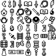

# Inventory
A list of weapons (spells) and treasures (items) from Zelda's Adventure and the sprites that inspired their pixel art.

## Abbreviations

- LA - Link's Awakening (gameboy)
- OoS - Oracle of Seasons (gameboy)
- LttP - Link to the Past (snes)
- BB - [Daniel Brother-Bear Barras](https://www.youtube.com/@TheRealMethuselah)

## Weapons (spells)

| Weapon | Source |
| :---------: | :---------: |
| Boomerang | LA - Boomerang |
| Bow & Arrow | BB - Bow & Arrow |
| Broadsword | LA - Link's Sword  |
| Calm | LA - Inspired by the library book |
| Dagger | Original pixel art |
| Gold Necklace | LA - Trading quest Mermaid's Necklace |
| Feather | LA - Roc's Feather |
| :---------: | :---------: |
| Firestorm | LA - Flame block cave route to turtle rock |
| Hammer | LttP - Magic Hammer |
| Jade Amulet | LttP - Magic Hammer |
| Jade Ring | OoS - Magic Ring |
| Joust | Original pixel art |
| Noise | LA - Inspired by the library book |
| Pyros | LA - Bomb |
| :---------: | :---------: |
| Ring of Fire | LA - Fireball |
| Roar Stick | LA - Trading quest Stick |
| Axe | Original pixel art |
| Turquoise Ring | Palette swap of Jade Ring |
| :---------: | :---------: |
| Wand | LA - Firerod |

## Treasures (items)

| Treasure | Source |
| :---------: | :---------: |
| Black Orb | LA - Eagle Tower Orb |
| Bone | Original pixel art |
| Bouquet | LA - Trading quest Hibiscus |
| :---------: | :---------: |
| Candle | BB - Candle |
| Coal | OoS - Subrosian Fake Ore |
| Diamond | Online Rupee sprite |
| Empty Bottle | LA - Inspired by Crazy Tracy's Secret Medicine |
| Flute | BB - Flute |
| Golden Boots | Palette swap of Red Boots |
| Harp | LA - Earth Harp |
| :---------: | :---------: |
| Key | LA - Key |
| Knife | Original pixel art |
| Ladder | Original pixel art |
| Life Potion | Original pixel art |
| Magic Shield | LA - L2 Shield |
| Plank | LA - Inspired by Raft |
| Map | LA - Map |
| Compass | LA - Compass |
| Raft | LA - Raft |
| Red Boots | LA - Pegasus Boots |
| Red Bow | LA - Trading quest Ribbon |
| Zora Repellant | Original pixel art |
| Rug | Original pixel art |
| Rupee | LA - Rupee |
| :---------: | :---------: |
| Salt Cellar | Original pixel art |
| Ticket A | LA - Inspired by Map |
| Ticket B | LA - Inspired by Map |
| Vial of Wind | Original pixel art |
| Full Bottle | LA - Inspired by Crazy Tracy's Secret Medicine |

## Misc.

| Misc | Source |
| :---------: | :---------: |
| Celestial Sign | LA - Piece of Power (inverted) |
